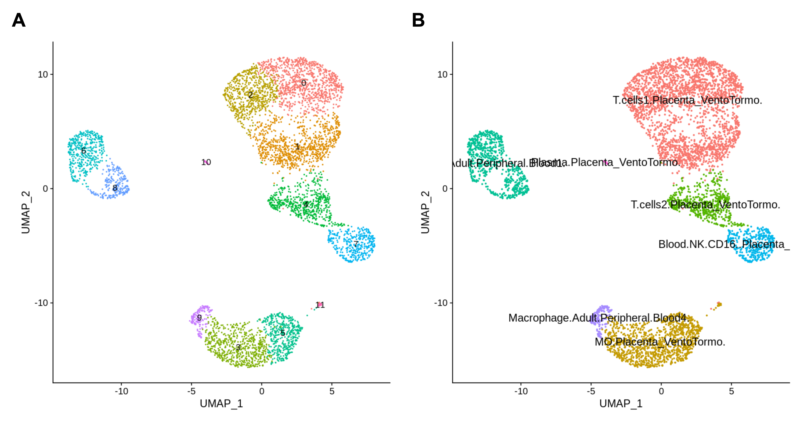
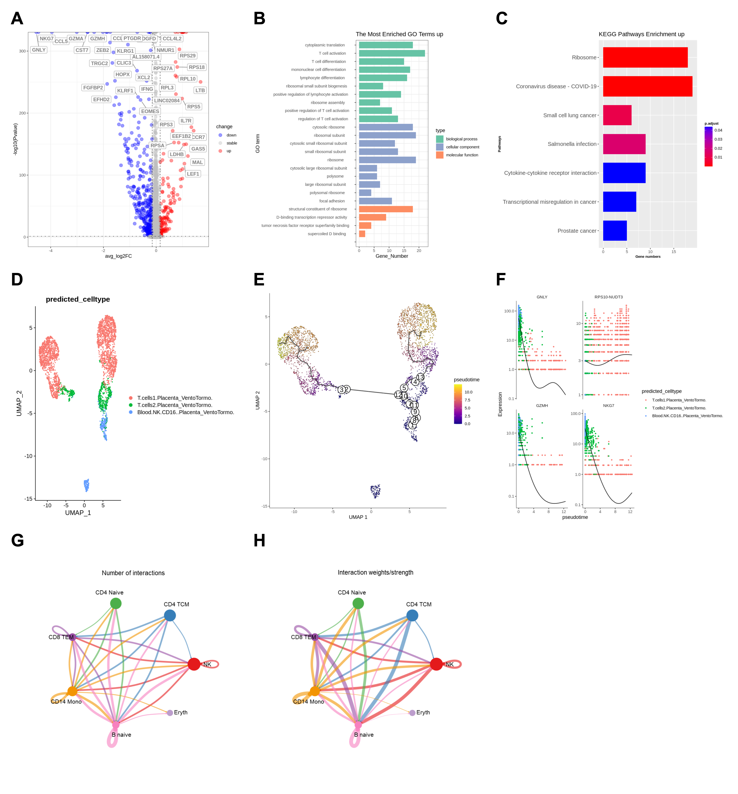
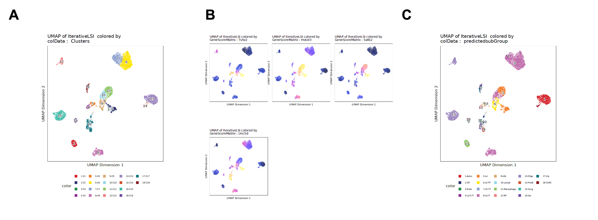

# Single Cell RNA and Single Cell ATAC Analysis

This repository contains my jupyter notebooks for the Single Cell Data Analysis course hosted by [CNGB](https://db.cngb.org/) and [BGI](https://www.bgi.com/global) between Sept. 2022 - Dec. 2022.

## Course Structure

The course contains lectures on basic and advanced scRNA and scATAC analysis with accompanying homeworks. The notebooks in this repository are my homework notebooks. The data used for the analyses are not stored in this repository. They can be downloaded inside the notebooks.

See [course materials at this link](docs.qq.com/doc/DR3NkamJ2cU9tTkRr), including slides, links to lectures, and Q&As (all in Chinese).

Selected steps of the analysis and brief explanations are written below for personal reference. Refer to the notebooks and the course materials for the code and full explanations.

Jump to sections:

1. [scRNA Basic Analysis](#1-scrna-basic-analysis)
2. [scRNA Advanced Analysis](#2-scrna-advanced-analysis)  
3. [scATAC Basic Analysis](#3-scatac-basic-analysis)

---

## 1. scRNA Basic Analysis

> Data: The data for this section come from scRNA-seq of peripheral blood mononuclear cells (PBMCs) sampled from patients with COVID-19. PBMCs are specialized blood cells with a single, round nucleus—primarily lymphocytes (T cells, B cells, NK cells) and monocytes—isolated from whole blood. Data from two samples of PBMCs are loaded in `Seurat`, which will be subsequently merged to remove batch variance.

Read [this document](./docs/Primer%20on%20scRNA%20Sequencing%20and%20Pre-processing.md) for a primer on scRNA-seq data generation and pre-processing steps.

Figure 1:  
**A.** Clustered single cells.  
**B.** Cell type annotations.  

---

### scRNA Data Processing

#### scRNA Quality Control

Low quality data are first filtered based on:

- Gene count per cell, UMI count per cell: too low > dead cell; too high > too many cells in one droplet;
- Mitochondria mRNA percentage: too high > signals cell death, necrosis, or extreme cell stress

The distributions were visualized in a violin plot and thresholds chosen manually (see notebook).

#### scRNA Data Transform

Use scTransform from [this paper](https://link.springer.com/article/10.1186/s13059-019-1874-1) to normalize (within cell), find variable genes, and scale (across genes) the data.

#### scRNA Linear Dimension Reduction

Use the variable genes identified for PCA. Use a scree plot to identify the number of PCs beyond which additional variance in the data is less explained. Those additional PCs contain noise in the data. The PCs kept are used as features for downstream analysis.

#### scRNA Non-linear Dimension Reduction

The PC-features are used for UMAP dimension reduction to **visualize** non-linear structure in the data. UMAP optimizes global and local neighborhood structure with two parameters:

- `n_neighbors`: balances local (smaller value) vs. global (larger value) structure. Should be between 5-50.
- `min_dist`: density of points. Smaller value leads to more refined local structure. Larger value leads to more even distribution of points. Should be between 0.001-0.5.

Note that UMAP is a visualization tool. It does not change the data.

#### scRNA Doublet Removal

Doublet means that two cells are captured in one vescicle. Keeping them would distort the data distribution. The doublets are detected using `DoubletFinder` from [this paper](https://www.cell.com/cell-systems/fulltext/S2405-4712(19)30073-0). Only singlets are kept for further analysis.

#### scRNA Data Transform for Filtered Data

Perform `scTransform`, PCA, and UMAP for the filtered data.

### scRNA Downstream Analysis

#### scRNA Data Merging

Three types of methods were used to merge the data and remove the batch effect:

- Merging directly
- Merging with anchors
- Merging with the `harmony` library

For this dataset, the merging with anchors method gave the best merging result.

#### scRNA Cell Clustering (Figure 1A)

The `PhenoGraph` pipeline:  

1. Propose initial clusters for the cells using KNN with a large K. Use Euclidean distance of the PCs to calculate cell-cell distance to define the neighborhoods.
2. Calculate the Jaccard index ($`\text{Jaccard}(A, B) = \frac{|N(A) \cap N(B)|}{|N(A) \cup N(B)|}`$) of the cells to adjust edge weights based on neighborhood similarity.
3. Use the Louvain algorithm to detect cell clusters where in-group edges are much stronger than inter-group edges.

#### scRNA Identify Marker Genes

Marker genes can be found for all clusters, one cluster vs. the other clusters, and one cluster vs. certain other clusters. The `MAST` library can be used for significance calculation. The library works well for zero-inflated negative binomial models of scRNA seq data.

#### scRNA Cluster Annotation (Figure 1B)

Annotating the clusters with cell types. The `scHCL` [library](https://github.com/ggjlab/scHCL/) was used. It contains information from scRNA-seq of different types of human cells and can label our cell types based on the marker genes.

---

## 2. scRNA Advanced Analysis

> This section continues from the previous section and uses the same data with labeled cell types.

**Figure 2:**  
**A:** Volcano plot of DEGs between cell types.  
**B:** GO enrichment.  
**C:** KEGG enrichment.  
**D:** Data subset for trajectory inference.  
**E:** Inferred trajectories.  
**F:** DEGs along the trajectory; genes with the 4 highest Moran's I are displayed.  
**G:** Communication between cell types; band width represents interaction counts.  
**H:** Communication between cell types; band width represents summed interaction weights.  

---

### scRNA Differentially Expressed Genes (DEGs)

Identifies DEGs between cell types using the `MAST` method. A volcano plot was plotted (Figure 2A)

#### scRNA Gene Ontology (GO) Analysis

Functional annotation of the DEGs using the cellular component (CC), biological process (BP), and molecular function (MF) ontologies (Figure 2B).

#### scRNA KEGG Pathway Analysis

Functional annotation of the DEGs using the KEGG pathways (Figure 2C).

### scRNA Trajectory Inference

Trajectory inference learns a development trajectory from the gene expression profiles of the single cells that can be seen as a "pseudotime" of cell development or disease progression. We use the `monocle3` library for trajectory inference with the following conceptual steps:

1. KNN clustering in the UMAP space.
2. Louvain clustering
3. Identify inter-group linkages that are stronger than random chance. These links are preserved.
4. Multiple components can be produced from the previous step. Each component independently proceeds to the next stage of trajectory calculation to yield the final trajectories.

> It is worth noting that step 1: KNN clustering in the UMAP space has a risk of getting different result each time since UMAP is a stochastic algorithm. However, since the UMAP reduction is done on the PCs, which should already remove much of the noise in the data, the relative geometry of the cells in the UMAP space should stay more or less consistent. In real work, always run it a few times and see if the trajectories inferred is consistent.

#### Select cell types to analyze

In this notebook, the data subset containing the cell types "T.cells1.Placenta_VentoTormo", "T.cells2.Placenta_VentoTormo", and "Blood.NK.CD16..Placenta_VentoTormo" were selected for analysis as they were close in the UMAP space (Figure 1B).

The data subset undergoes data transforms and dimensionality reduction again (Figure 2D).

#### Network Visualization

The network is constructed and visualized with `igraph`. After choosing a starting cell type, the cell development trajectory can be plotted (Figure 2E).

#### DEGs along pseudotime

Identifies the DEGs along the development trajectory. The statistical measure used by `monocle3` is Moran's I, which measures autocorrelation between gene expression and the trajectory. High value means cells close to each other on the trajectory have similar expression levels for this gene (Figure 2F).

### scRNA Cell Communication Analysis

Cell communication analysis finds which cells "talk" to each other via ligand-receptor expressions. The ligand-receptor database we use is aptly called `CellchatDB`. It contains data for 3 types of cell communication: ECM receptor, cell contact, secreted signaling. Since we are studying PBMCs, we use only the secreted signaling part of the DB.

`Cellchat` works in the following conceptual steps:

1. Find over-expressed ligand and receptor genes in cells, optionally to use the PPI network to correct for transcripts missed by sequencing artifacts.  
2. Use permutation test to calculate the probability of cross-talk between cell types.  
3. Aggregate LR pairs into signaling pathways.  
4. Count the active LR pairs between cell types (Figure 2G) and sum the probability values (Figure 2H) to identify the dominant communication channels.

---

## 3. scATAC Basic Analysis

> Data: The data come from scATAC-seq of mouse brain cells. The analysis was conducted using the `ArchR` package.

Read [this document](./docs/Primer%20on%20scATAC%20Sequencing%20and%20Pre-processing.md) for a primer on scATAC-seq data generation and pre-processing steps.

**Figure 3:**  

**A.** Clustering.  
**B.** Top 4 cluster-wise marker genes.  
**C.** Cell type annotation.  

---

### scATAC Data Processing

#### scATAC Doublet Removal

Doublets (two cells in one vesicle) are identified in a manner similar to [the scRNA doublet removal method](#scrna-doublet-removal).

#### scATAC Quality Control

QC was done based on 3 criteria:

1. **Number of fragments mapped to the nuclear genome:** too high may indicate doublets; too low may indicate deadcells.  
2. **Transcription start site (TSS) enrichment score:**

    - **Rationale:** The TSS enrichment score compares the density of fragments at the start of genes (where chromatin is typically open) versus the "background" noise in the rest of the genome.
    - **QC Objective:** A low score usually indicates cell death or nuclear lysis. In these cases, the DNA is no longer protected by its organized structure, causing the Tn5 transposase to cut the genome randomly rather than focusing on the actual open sites.

3. **Fragment length distribution:**

    - **Rationale:** DNA in the open chromatin region is wrapped around nucleosomes. The Tn5 transpose can only cut at the linker sequence between the nucleosomes. Since each nucleosome is wrapped by about 147 base pairs (bp). There is should be some regularity in fragment lengths (multiples of 147 bps).
    - **QC Objective:** We check if the fragment size is clustered at around 147 bps and if there is a staircase pattern in the distribution resulting from the regularity. If none, this indicates the DNA is degraded or the Tn5 reaction went wrong.

#### scATAC Dimension Reduction

scATAC data is inherently different from scRNA data that it is more sparse and is binary. Instead of transcript counts, we read open/close of the chromatin regions. For this reason, iterative LSI dimension reduction, instead of PCA, is more suitable. Abstracting from much of the mathematics behind, it is an iterative way to find the optimal dimension reduction using equal sized bins on the genome to prevent bias, while retaining cell cluster specific ATAC signature.

### scATAC Downstream Analysis

#### scATAC Clustering

Clustering was performed on the LSI reduced dimensions using the Seurat method described in [this section](#scrna-cell-clustering-figure-1a).

#### scATAC Marker Gene Identification

To obtain a continuous gene expression value from the binary ATAC data, `ArchR` predicts a Gene Activity Score considering:

1. Fragments inside the gene body, given full weight;  
2. Fragments at different distances from the gene body, given weights from a weighting function;  
3. Fragments outside the gene boundary, no weight given.  

The gene activity score is a proxy of how much gene expression might this chromatin opening lead to.

Since scATAC data are sparse, the `MAGIC (Markov Affinity-based Graph Imputation of Cells)` method is used to impute values for missing fragments that might've existed from cells that are similar when looking at the entire ATAC profile.

#### scATAC Cell Type Annotation

Cell type annotation uses scRNA data as reference. Since the scATAC data come from mouse brain, a labeled scRNA mouse brain scRNA dataset from the Allen Brain Institute was downloaded for cell type annotation.

Conceptually, the algorithm finds an alignment where the gene activity scores from scATAC and gene expression from scRNA are maximally correlated. Then labels are transferred from the scRNA dataset to the scATAC dataset.

---

## 4. scATAC Advanced Analysis

Writing in progress